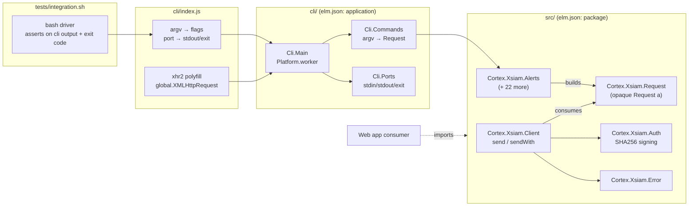

# Cortex XSIAM Elm SDK + CLI — bootstrap plan


## Context


This is a fresh repo (only `.gitignore` and `.git`). The goal is an Elm project that

serves two consumers from one shared codebase:


1. **A library** other Elm web apps can depend on (`type: package` in `elm.json`).

2. **A CLI binary** for terminal use (`xsiam ...`), which doubles as the

   integration-test driver.


The SDK targets the Cortex XSIAM REST API. XSIAM exposes ~23 sub-APIs (Alerts,

Incidents, Endpoints, XQL, Assets, Audit, Response Actions, Scripts, IOCs, BIOCs,

Correlation Rules, Playbooks, Dashboards, Widgets, Auth Settings, Syslog Servers,

Attack Surface Rules, Scheduled Queries, Dataset Management, Lookup Datasets,

System Management, Script Execution, XQL User Datasets). OpenAPI specs and

guidance docs and OpenAPI specs live under `docs/` (committed by the user but

not yet synced to this planning session — implementation will read them

directly from `docs/cortex-api-openapi/` per sub-API).


The project uses **Advanced API Authentication**: each request is signed with a

SHA-256 hash of `apiKey ++ nonce ++ timestamp`, sent alongside `x-xdr-auth-id`,

`x-xdr-timestamp`, and `x-xdr-nonce` headers. This makes signing an effectful

step (needs current time + randomness), which shapes the library API.


We bootstrap with the auth + transport foundation and **one** sub-API end-to-end

(Alerts → Get all alerts), then iterate. Decisions locked in with the user:


- Sub-APIs are **hand-written**, one Elm module each.

- CLI lives in **`cli/`** subdirectory with its own `elm.json`; root stays a

  publishable `package`.

- Integration tests **reuse the CLI binary**, driven by a shell script + env vars.

- Only integration testing against a real tenant. No unit tests.

- `elm-format` enforced via Make target.


**Secrets**: real credentials (API key, key ID, tenant URL) go in a local

`.envrc` that is gitignored. Never commit them.


---


## Architecture





**Key insight**: a `Request a` is a pure description (method, path, body, query,

decoder). Effects — time, randomness, signing, HTTP — only happen inside

`Client.send`. This means every sub-API module is a thin, easily-testable layer

of typed wrappers, and the same `Request` works in browser and Node.


---


## File layout


```

/home/user/repo/

├── elm.json                          # type: package, exposed-modules list

├── src/

│   └── Cortex/

│       └── Xsiam/

│           ├── Auth.elm              # signing primitives (pure)

│           ├── Client.elm            # Config, send, sendWith, toRequestRecord

│           ├── Error.elm             # Error type

│           ├── Request.elm           # opaque Request a + builders (internal)

│           └── Alerts.elm            # FIRST sub-API; template for the rest

├── cli/

│   ├── elm.json                      # type: application, source-dirs ["src","../src"]

│   ├── src/

│   │   └── Cli/

│   │       ├── Main.elm              # Platform.worker entrypoint

│   │       ├── Commands.elm          # subcommand dispatch

│   │       └── Ports.elm             # stdout/stderr/exit ports

│   ├── index.js                      # node wrapper + xhr2 polyfill

│   └── bin/

│       └── xsiam                     # shebang launcher → node ../index.js

├── tests/

│   └── integration.sh                # bash driver, env-var auth, asserts on cli

├── .envrc.example                    # XSIAM_TENANT_URL=, XSIAM_API_KEY=, XSIAM_API_KEY_ID=

├── .gitignore                        # add .envrc, elm-stuff/, node_modules/, cli/dist/

├── package.json                      # devDeps: xhr2; scripts: build, format, test

├── Makefile                          # format, build, test, clean targets

├── README.md                         # quickstart for both library + CLI

└── TEST.md                           # endpoint × CLI command × tested? table

```


---


## Library API design


### `Cortex.Xsiam.Request` (internal-ish; not exposed verbatim)


```elm

type Request a

    = Request

        { method : String                    -- "GET" | "POST" | ...

        , path : List String                 -- ["public_api","v1","alerts","get_alerts_multi_events"]

        , query : List ( String, String )

        , body : Encode.Value                -- Encode.null for GET

        , decoder : Decoder a                -- response body decoder

        }


get : List String -> Decoder a -> Request a

post : List String -> Encode.Value -> Decoder a -> Request a

withQuery : List ( String, String ) -> Request a -> Request a

map : (a -> b) -> Request a -> Request b

```


### `Cortex.Xsiam.Auth` (pure, exposed for advanced users)


```elm

type alias Credentials =

    { apiKeyId : String, apiKey : String }


type alias Stamp =

    { timestamp : Int, nonce : String }


{-| Pure signing: produce the four advanced-auth headers from creds + stamp.

    Uses SHA-256 over (apiKey ++ nonce ++ String.fromInt timestamp).

-}

sign : Credentials -> Stamp -> List Http.Header


{-| Default nonce generator — 64 chars [A-Za-z0-9], seeded from Time.now.

    Good enough for uniqueness; not crypto-grade. CLI uses node crypto instead.

-}

nonceGenerator : Random.Generator String

```


SHA-256 dependency: **`folkertdev/elm-sha2`** (pure Elm, fast, `elm/bytes`-based).

Fallback: `ktonon/elm-crypto`.


### `Cortex.Xsiam.Client`


```elm

type alias Config =

    { tenant : String          -- e.g. "https://api-joris.xdr.eu.paloaltonetworks.com"

    , credentials : Auth.Credentials

    }


{-| Default send: derives timestamp from Time.now and nonce from elm/random.

    Suitable for browser apps.

-}

send : Config -> (Result Error a -> msg) -> Request a -> Cmd msg


{-| Escape-hatch send: caller supplies the stamp. CLI uses this with stamps

    sourced from node's crypto.randomBytes via flags.

-}

sendWith : Auth.Stamp -> Config -> (Result Error a -> msg) -> Request a -> Cmd msg


{-| Pure record for consumers who want to drive Http themselves. -}

toRequestRecord :

    Config

    -> Auth.Stamp

    -> Request a

    -> { method : String

       , headers : List Http.Header

       , url : String

       , body : Http.Body

       , decoder : Decoder a

       }

```


`send` implementation pattern:


```elm

send config toMsg req =

    Time.now

        |> Task.map Time.posixToMillis

        |> Task.andThen

            (\ts ->

                let

                    seed = Random.initialSeed ts

                    ( nonce, _ ) = Random.step Auth.nonceGenerator seed

                    rec = toRequestRecord config { timestamp = ts, nonce = nonce } req

                in

                Http.task

                    { method = rec.method

                    , headers = rec.headers

                    , url = rec.url

                    , body = rec.body

                    , resolver = Http.stringResolver (decodeXsiamResponse rec.decoder)

                    , timeout = Just 30000

                    }

            )

        |> Task.attempt toMsg

```


### `Cortex.Xsiam.Error`


```elm

type Error

    = NetworkError

    | Timeout

    | BadStatus Int String         -- includes XSIAM err_msg from envelope

    | BadBody String               -- decoder failure

    | BadUrl String

```


### `Cortex.Xsiam.Alerts` — template for all 23 sub-APIs


Each sub-API module follows the same shape: a record per logical endpoint, an

encoder for the request payload, a decoder for the response, and a function

that returns a `Request a`. **No effects, no HTTP**.


```elm

module Cortex.Xsiam.Alerts exposing (Alert, GetAllParams, getAll)


type alias Alert =

    { internalId : Int

    , severity : String

    , category : String

    , -- ...fields per OpenAPI schema

    }


type alias GetAllParams =

    { from : Maybe Int, to : Maybe Int, sort : Maybe String }


defaultGetAllParams : GetAllParams

defaultGetAllParams = { from = Nothing, to = Nothing, sort = Nothing }


getAll : GetAllParams -> Request (List Alert)

getAll params =

    Request.post

        [ "public_api", "v1", "alerts", "get_alerts_multi_events" ]

        (encodeGetAllParams params)

        (Decode.field "reply" (Decode.field "alerts" (Decode.list alertDecoder)))

```


The XSIAM response envelope is `{ "reply": ... }`; decoders peel it off

inside the sub-API module so callers see only the payload.


---


## CLI design


### `cli/elm.json`


```json

{

    "type": "application",

    "source-directories": ["src", "../src"],

    "elm-version": "0.19.1",

    "dependencies": {

        "direct": {

            "elm/core": "1.0.5",

            "elm/json": "1.1.3",

            "elm/http": "2.0.0",

            "elm/time": "1.0.0",

            "elm/random": "1.0.0",

            "elm/bytes": "1.0.8",

            "folkertdev/elm-sha2": "1.0.0"

        },

        "indirect": {}

    },

    "test-dependencies": { "direct": {}, "indirect": {} }

}

```


### `cli/src/Cli/Main.elm` — `Platform.worker`


Flags coming in from Node:


```elm

type alias Flags =

    { argv : List String         -- argv after the binary name

    , tenant : String            -- $XSIAM_TENANT_URL

    , apiKeyId : String          -- $XSIAM_API_KEY_ID

    , apiKey : String            -- $XSIAM_API_KEY

    , timestamp : Int            -- Date.now() from node

    , nonce : String             -- crypto.randomBytes(32).toString('hex')

    }

```


The CLI uses `Client.sendWith` (escape hatch) so the nonce comes from Node's

`crypto.randomBytes` rather than `Math.random`.


### `cli/src/Cli/Ports.elm`


```elm

port stdout : String -> Cmd msg

port stderr : String -> Cmd msg

port exit : Int -> Cmd msg

```


### `cli/src/Cli/Commands.elm`


Single source of truth for argv → `Request` mapping. Initial bootstrap supports

one command (`alerts list`); the table grows one row per new sub-API method.


```elm

dispatch : List String -> Result String (Request Encode.Value)

dispatch args =

    case args of

        [ "alerts", "list" ] ->

            Ok (Alerts.getAll Alerts.defaultGetAllParams |> Request.map encodeAlerts)


        _ ->

            Err (usage args)

```


The CLI prints whatever `Encode.Value` the dispatcher returns as pretty JSON to

stdout, exit 0 on success, exit non-zero with an error to stderr otherwise.

This gives the integration test driver a stable contract: stdout = JSON,

exit code = success.


### `cli/index.js`


```js

#!/usr/bin/env node

global.XMLHttpRequest = require('xhr2');

const crypto = require('crypto');

const { Elm } = require('./dist/elm.js');


const app = Elm.Cli.Main.init({

    flags: {

        argv: process.argv.slice(2),

        tenant: process.env.XSIAM_TENANT_URL || '',

        apiKeyId: process.env.XSIAM_API_KEY_ID || '',

        apiKey: process.env.XSIAM_API_KEY || '',

        timestamp: Date.now(),

        nonce: crypto.randomBytes(32).toString('hex'),

    },

});


app.ports.stdout.subscribe(s => process.stdout.write(s));

app.ports.stderr.subscribe(s => process.stderr.write(s));

app.ports.exit.subscribe(code => process.exit(code));

```


### `cli/bin/xsiam`


```sh

#!/usr/bin/env sh

exec node "$(dirname "$0")/../index.js" "$@"

```


Build step compiles `cli/src/Cli/Main.elm` → `cli/dist/elm.js`.


---


## Integration testing


### `tests/integration.sh`


```sh

#!/usr/bin/env bash

set -euo pipefail


: "${XSIAM_TENANT_URL:?set in .envrc}"

: "${XSIAM_API_KEY:?set in .envrc}"

: "${XSIAM_API_KEY_ID:?set in .envrc}"


XSIAM=./cli/bin/xsiam

PASS=0; FAIL=0


run() {

    local name="$1"; shift

    if out=$("$XSIAM" "$@" 2>&1); then

        echo "PASS  $name"; PASS=$((PASS+1))

    else

        echo "FAIL  $name -- $out"; FAIL=$((FAIL+1))

    fi

}


run "alerts/list"     alerts list

# more rows added as sub-APIs land


echo "---"; echo "$PASS passed, $FAIL failed"

[ "$FAIL" -eq 0 ]

```


Each new read-only endpoint adds one `run` line. Write endpoints stay commented

out by default (license / safety) and `TEST.md` records why.


### `TEST.md` shape


| Sub-API   | Endpoint              | CLI command            | Tested | Notes              |

|-----------|-----------------------|------------------------|--------|--------------------|

| Alerts    | get_alerts_multi_events | `xsiam alerts list`  | yes    | read-only          |

| Incidents | get_incidents         | `xsiam incidents list` | no     | not yet wired      |

| Incidents | update_incident       | -                      | no     | write — license    |

| ...       |                       |                        |        |                    |


The table is updated in the same PR that adds each sub-API.


---


## Tooling


### `elm.json` (root, package)


```json

{

    "type": "package",

    "name": "<github-user>/elm-cortex-xsiam",

    "summary": "Elm SDK for the Cortex XSIAM REST API",

    "license": "MIT",

    "version": "1.0.0",

    "exposed-modules": [

        "Cortex.Xsiam.Auth",

        "Cortex.Xsiam.Client",

        "Cortex.Xsiam.Error",

        "Cortex.Xsiam.Request",

        "Cortex.Xsiam.Alerts"

    ],

    "elm-version": "0.19.0 <= v < 0.20.0",

    "dependencies": {

        "elm/core": "1.0.0 <= v < 2.0.0",

        "elm/http": "2.0.0 <= v < 3.0.0",

        "elm/json": "1.0.0 <= v < 2.0.0",

        "elm/time": "1.0.0 <= v < 2.0.0",

        "elm/random": "1.0.0 <= v < 2.0.0",

        "elm/bytes": "1.0.0 <= v < 2.0.0",

        "folkertdev/elm-sha2": "1.0.0 <= v < 2.0.0"

    },

    "test-dependencies": {}

}

```


### `Makefile`


```make

.PHONY: format build test clean


format:

	elm-format src/ cli/src/ --yes


build: format

	cd cli && elm make src/Cli/Main.elm --optimize --output=dist/elm.js


test: build

	./tests/integration.sh


clean:

	rm -rf elm-stuff cli/elm-stuff cli/dist

```


### `package.json`


```json

{

  "name": "elm-cortex-xsiam-cli",

  "private": true,

  "bin": { "xsiam": "./cli/bin/xsiam" },

  "devDependencies": { "xhr2": "^0.2.1" },

  "scripts": {

    "build": "make build",

    "format": "make format",

    "test": "make test"

  }

}

```


### `.gitignore` (append)


```

elm-stuff/

node_modules/

cli/dist/

.envrc

```


### `.envrc.example`


```sh

export XSIAM_TENANT_URL="https://api-<tenant>.xdr.<region>.paloaltonetworks.com"

export XSIAM_API_KEY_ID="<your key id>"

export XSIAM_API_KEY="<your advanced api key>"

```


The user already has working credentials; they go in a local `.envrc` (gitignored).


---


## Implementation order


1. **Repo skeleton**: root `elm.json` (package), empty `src/Cortex/Xsiam/`,

   `package.json`, `Makefile`, `.gitignore`, `.envrc.example`, `README.md`

   stub, `TEST.md` skeleton.

2. **Library foundation**:

   - `Cortex.Xsiam.Error`

   - `Cortex.Xsiam.Request` (opaque type + builders)

   - `Cortex.Xsiam.Auth` (signing + nonce generator) — wire in

     `folkertdev/elm-sha2`

   - `Cortex.Xsiam.Client` (`Config`, `send`, `sendWith`, `toRequestRecord`,

     XSIAM envelope unwrapping in error paths)

   - `elm make` clean from the library root.

3. **First sub-API**: `Cortex.Xsiam.Alerts` with `getAll`, decoder modeled on

   the OpenAPI spec under `docs/cortex-api-openapi/` (read during impl).

4. **CLI scaffold**:

   - `cli/elm.json`, `Cli.Ports`, `Cli.Main`, `Cli.Commands` with one route

     (`alerts list`).

   - `cli/index.js` with xhr2 polyfill + crypto nonce.

   - `cli/bin/xsiam` launcher.

   - `make build` produces a working binary.

5. **Smoke test against real tenant**: `./cli/bin/xsiam alerts list` against

   the user's tenant returns JSON. This validates auth, transport, decoder,

   and CLI plumbing in one shot.

6. **Test harness**: `tests/integration.sh` with the one passing assertion;

   `make test` green. Update `TEST.md`.

7. **Format pass**: `make format`; commit.

8. **Iterate**: each new sub-API repeats steps 3 + adds one CLI route + one

   `tests/integration.sh` line + one `TEST.md` row. The pattern is

   mechanical; the foundation does not need to change.


---


## Verification


End-to-end smoke test once steps 1–6 land:


```sh

make format          # zero diff

make build           # compiles cli/dist/elm.js

source .envrc        # local secrets, never committed

./cli/bin/xsiam alerts list   # → JSON to stdout, exit 0

make test            # tests/integration.sh green

```


Failure modes to watch for during the smoke test:


- 401 / 403 → signing wrong (header order, hash input, timestamp units).

  `Auth.sign` test vector: hand-compute a SHA256 in a python REPL and compare.

- `BadBody` → XSIAM envelope shape differs from OpenAPI; tighten decoder.

- `XMLHttpRequest is not defined` → xhr2 polyfill not loaded before

  `Elm.Cli.Main.init`.

- Empty `argv` → `process.argv.slice(2)` needs the `node index.js` prefix

  stripped, which `.slice(2)` already handles for the `xsiam` shim.


---


## Critical files (to read / create during implementation)


- `docs/cortex-api-openapi/*` — source of truth for endpoint paths, params,

  schemas. Read per sub-API.

- `docs/*` — Elm guidance (read during steps 2–4).

- `src/Cortex/Xsiam/Auth.elm` — signing correctness is the linchpin.

- `src/Cortex/Xsiam/Client.elm` — only place that touches Time/Random/Http.

- `cli/index.js` — xhr2 polyfill must come before `require('./dist/elm.js')`.

- `tests/integration.sh` — coverage grows here; keep it shell-readable.

- `TEST.md` — kept in sync per PR.
